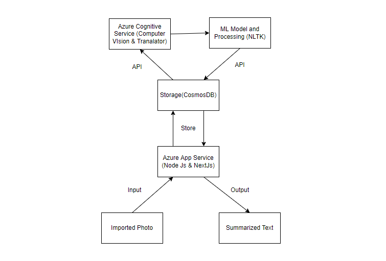

# Moodify
Aplikasi web yang yang digunakan untuk translasi dan  meringkas bacaan dari foto buku fisik.  

NAMA KELOMPOK ANDA   
Ketua Kelompok: Alvin Indra Kurniawan   
Anggota 1: Alvin Indra Kurniawan -19/439808/TK/48538  
Anggota 2:  Dimas Mahendra Nugraha - 19/444048/TK/49244  
Anggota 3: Roby Attoillah - 19/444068/TK/49264   
Anggota 4: Raihan Ramadhan Hanif Mintarso - 19/444066/TK/49262  

aplikasi web ini akan memproses photo buku fisik yang kita input, setelahnya akan diproses dam akan menampilkan text hasil ringkasan dari foto buku.
untuk skematik kerangkanya seperti berukut>>  

#### Skematik
  

#### Paparan 
Pada Project ini, menggunakan NextJs sebagai framework ReactJs untuk keperluan frontendnya. dan akan dideploy menggunakan azure app service.
pada bagian frontend nantinya akan menuntun pengguna untuk melakukan input foto buku fisik yang ingin mereka dapatkan hasil ringkasannya.  

setelah foto tersebut diterima selanjutnya akan diteruskan ke azure app service untuk keperluan backend yang akan disimpan data sementaranya di CosmosDB. 
pada bagian backend terdapat beberaoa flow yang berlangsung: 

1. Foto akan diproses dan dibaca oleh azure cognitive service-computer vision dan didapatkan isi text dari foto yang diinput tadi. 
2. setelah itu text akan ditranslate dengan menggunakan azure cognitive service-Translator dan didapatkan diterjemahkan ke bahasa yang diinginkan 
3. setelah itu text yang sudah diterjemahkan, selanjutnya di rinkas pada ML yaitu NLTK dengan menggunakan text summarization. 
4. text yang telah di ringkas ditampilkan pada web Moodify. 
 
Skematik masih dapat berubah sesuai dengan pertimbangan dan setelah mendapatkan ilmu baru ketika melakukan praktikum di modul selanjutnya. 